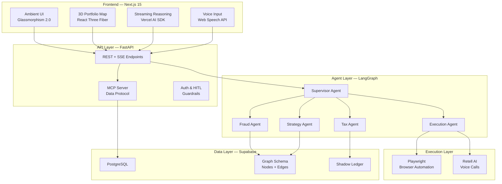

# 🏦 ArthTantra — Autonomous Financial Digital Twin

> **VoidHack 2026** | Full-Stack Implementation Plan

## Overview

ArthTantra is a multi-layered AI-powered financial agent platform consisting of:
- **Frontend**: Next.js 15 + Tailwind CSS + React Three Fiber + Vercel AI SDK
- **Backend**: FastAPI (Python) + LangGraph multi-agent orchestration
- **Database**: Supabase (PostgreSQL) with in-app graph modeling
- **Automation**: Playwright (browser automation) + Retell AI (voice agent)
- **Protocol**: MCP (Model Context Protocol) for standardized data ingestion

---

## User Review Required

> [!IMPORTANT]
> **API Keys Needed**: You will need to provide API keys for: Gemini/OpenAI (LLM), Supabase, Plaid (or mock), Polygon.io (or mock), and Retell AI (optional). For the hackathon demo, I will build with mock data fallbacks so the app runs without paid API keys.

> [!WARNING]
> **Apache AGE on Supabase**: Apache AGE (graph DB extension) is NOT supported on managed Supabase. Instead, I will model the knowledge graph using standard PostgreSQL tables with a graph-like schema (nodes/edges tables) and query it with recursive CTEs. This gives us the same demo capability without infrastructure blockers.

> [!IMPORTANT]
> **Scope for 48-hour hackathon**: Some features like real Plaid bank connections and live Retell AI voice calls require paid API accounts. I will build the full integration layer but default to **simulated/mock modes** so the demo works end-to-end without live credentials.

## Open Questions

1. **LLM Provider**: Do you want to use **Gemini 1.5 Pro** (free tier available) or **OpenAI GPT-4o** (requires paid API key)? I'll code for Gemini with an easy swap to OpenAI.
2. **Supabase**: Do you have an existing Supabase project, or should I create a local SQLite/PostgreSQL fallback for development?
3. **Demo Data**: Should I generate realistic Indian financial data (INR, UPI, NEFT) or US-centric data (USD, ACH)?
4. **Voice**: Do you have a Retell AI account? If not, I'll build the integration with a mock voice simulator for the demo.

---

## Architecture Diagram



---

## Project Structure

```
e:\projects\ArthTantra\
├── frontend/                          # Next.js 15 App
│   ├── src/
│   │   ├── app/
│   │   │   ├── layout.tsx             # Root layout with fonts, metadata
│   │   │   ├── page.tsx               # Landing / Dashboard
│   │   │   ├── globals.css            # Glassmorphism design system
│   │   │   ├── dashboard/
│   │   │   │   └── page.tsx           # Main dashboard view
│   │   │   └── api/
│   │   │       └── chat/
│   │   │           └── route.ts       # Vercel AI SDK → FastAPI proxy
│   │   ├── components/
│   │   │   ├── ui/
│   │   │   │   ├── GlassPanel.tsx     # Glassmorphism card component
│   │   │   │   ├── StreamingText.tsx  # AI reasoning stream display
│   │   │   │   ├── MetricCard.tsx     # Financial metric display
│   │   │   │   └── VoiceButton.tsx    # Voice input trigger
│   │   │   ├── dashboard/
│   │   │   │   ├── AgentSwarm.tsx     # Agent status visualization
│   │   │   │   ├── ShadowLedger.tsx   # Transaction anomaly view
│   │   │   │   ├── NetWorthVelocity.tsx # Predictive chart
│   │   │   │   └── ActionLog.tsx      # Autonomous action history
│   │   │   ├── three/
│   │   │   │   ├── PortfolioMap.tsx   # 3D topographic portfolio
│   │   │   │   ├── TerrainShader.ts   # Custom GLSL for contours
│   │   │   │   └── SceneSetup.tsx     # R3F Canvas + controls
│   │   │   └── chat/
│   │   │       ├── ChatInterface.tsx  # Main AI chat panel
│   │   │       └── ReasoningStream.tsx # Live agent monologue
│   │   ├── hooks/
│   │   │   ├── useVoice.ts           # Web Speech API hook
│   │   │   └── useAgentStream.ts     # SSE stream consumer
│   │   └── lib/
│   │       ├── api.ts                # FastAPI client
│   │       └── types.ts              # Shared TypeScript types
│   ├── public/
│   ├── package.json
│   ├── tailwind.config.ts
│   ├── tsconfig.json
│   └── next.config.ts
│
├── backend/                           # Python FastAPI + LangGraph
│   ├── app/
│   │   ├── __init__.py
│   │   ├── main.py                   # FastAPI app entry
│   │   ├── config.py                 # Environment & settings
│   │   ├── api/
│   │   │   ├── __init__.py
│   │   │   ├── routes.py             # REST + SSE endpoints
│   │   │   └── middleware.py         # CORS, auth, rate limiting
│   │   ├── agents/
│   │   │   ├── __init__.py
│   │   │   ├── state.py              # LangGraph shared state schema
│   │   │   ├── graph.py              # Main agent graph definition
│   │   │   ├── supervisor.py         # Supervisor/router agent
│   │   │   ├── fraud_agent.py        # Fraud detection agent
│   │   │   ├── tax_agent.py          # Tax optimization agent
│   │   │   ├── strategy_agent.py     # Financial strategy agent
│   │   │   └── execution_agent.py    # Autonomous action agent
│   │   ├── tools/
│   │   │   ├── __init__.py
│   │   │   ├── financial.py          # Financial calculation tools
│   │   │   ├── browser.py            # Playwright automation tools
│   │   │   ├── voice.py              # Retell AI voice tools
│   │   │   └── data.py               # Database query tools
│   │   ├── mcp/
│   │   │   ├── __init__.py
│   │   │   ├── server.py             # MCP server implementation
│   │   │   └── providers/
│   │   │       ├── plaid.py          # Plaid bank data provider
│   │   │       ├── polygon.py        # Market data provider
│   │   │       └── mock.py           # Mock data for demo
│   │   ├── db/
│   │   │   ├── __init__.py
│   │   │   ├── supabase.py           # Supabase client
│   │   │   ├── graph_schema.py       # Graph-model tables
│   │   │   └── seed.py               # Demo data seeding
│   │   └── models/
│   │       ├── __init__.py
│   │       ├── transaction.py        # Transaction models
│   │       ├── agent_state.py        # Agent state models
│   │       └── user.py               # User profile models
│   ├── requirements.txt
│   ├── .env.example
│   └── Dockerfile
│
├── .env.example                       # Root env template
├── README.md
└── docker-compose.yml                 # Optional local orchestration
```

---

## Proposed Changes — Phased Build Order

### Phase 1: Foundation & Scaffolding (Build First)

#### Backend Foundation

##### [NEW] `backend/requirements.txt`
Core Python dependencies: `fastapi`, `uvicorn`, `langgraph`, `langchain-google-genai`, `langchain-openai`, `python-dotenv`, `supabase`, `pydantic`, `playwright`, `retell-sdk`, `sse-starlette`, `httpx`.

##### [NEW] `backend/app/main.py`
FastAPI application with CORS middleware, SSE streaming support, health check endpoint, and mounting of all API routes.

##### [NEW] `backend/app/config.py`
Pydantic Settings class loading from `.env`: LLM provider selection, API keys, Supabase URL/key, feature flags for mock mode.

##### [NEW] `backend/app/api/routes.py`
Core API endpoints:
- `POST /api/chat` — Main agent interaction (SSE streaming response)
- `GET /api/agents/status` — Agent swarm health/status
- `POST /api/actions/approve` — HITL approval endpoint
- `GET /api/portfolio` — Portfolio data for 3D map
- `GET /api/transactions` — Shadow ledger transactions
- `GET /api/anomalies` — Detected anomalies

##### [NEW] `backend/app/api/middleware.py`
CORS configuration for Next.js frontend, request logging.

---

#### Frontend Foundation

##### [NEW] `frontend/` (via create-next-app)
Scaffold Next.js 15 with TypeScript, Tailwind CSS, App Router, src directory.

##### [NEW] `frontend/src/app/globals.css`
Complete Glassmorphism 2.0 design system:
- CSS custom properties for colors, glass effects, gradients
- Dark mode as default (deep navy/charcoal base)
- Glass panel styles with `backdrop-filter: blur()` and subtle borders
- Animated gradient backgrounds
- Glow effects for interactive elements
- Typography system using Inter/Outfit from Google Fonts

##### [NEW] `frontend/src/app/layout.tsx`
Root layout with: Google Fonts (Inter + Outfit), metadata/SEO, dark theme body, animated gradient background.

##### [NEW] `frontend/src/app/page.tsx`
Landing page / auto-redirect to dashboard.

---

### Phase 2: Multi-Agent Cognitive Engine (Epic 1)

##### [NEW] `backend/app/agents/state.py`
LangGraph `TypedDict` state schema:
```python
class AgentState(TypedDict):
    messages: list          # Conversation history
    current_agent: str      # Active agent name
    financial_context: dict # Portfolio, transactions, goals
    pending_actions: list   # Actions awaiting HITL approval
    reasoning_log: list     # Internal monologue for streaming
    verification: dict      # Double-check results
```

##### [NEW] `backend/app/agents/graph.py`
Main LangGraph `StateGraph` definition:
- **Nodes**: supervisor, fraud_agent, tax_agent, strategy_agent, execution_agent, verifier, human_approval
- **Edges**: Conditional routing from supervisor based on intent classification
- **Cycles**: Verifier node loops back if math doesn't check out
- **Interrupt**: `interrupt_before=["human_approval"]` for HITL on actions > $50

##### [NEW] `backend/app/agents/supervisor.py`
Supervisor agent that:
- Classifies user intent (fraud check, tax query, strategy, execution)
- Routes to appropriate specialist agent
- Synthesizes final responses from sub-agents
- Streams reasoning steps via `get_stream_writer()`

##### [NEW] `backend/app/agents/fraud_agent.py`
Fraud detection agent with tools:
- Analyze transaction patterns for anomalies
- Cross-reference shadow ledger entries
- Flag suspicious merchant relationships
- Cyclical verification: re-checks flagged items before reporting

##### [NEW] `backend/app/agents/tax_agent.py`
Tax optimization agent with tools:
- Calculate tax liability estimates
- Identify deductible expenses
- Suggest tax-loss harvesting opportunities
- Double-check calculations with verification loop

##### [NEW] `backend/app/agents/strategy_agent.py`
Financial strategy agent with tools:
- Net worth velocity calculation (stochastic modeling)
- Opportunity cost analysis of micro-habits
- Portfolio rebalancing suggestions
- Risk-adjusted return projections

##### [NEW] `backend/app/agents/execution_agent.py`
Autonomous execution agent:
- Coordinates with Playwright for web actions
- Coordinates with Retell AI for voice actions
- Enforces $50 HITL threshold
- Logs all attempted/completed actions

---

### Phase 3: Data Layer & Shadow Ledger (Epic 2)

##### [NEW] `backend/app/db/graph_schema.py`
PostgreSQL graph-model schema (no Apache AGE needed):
```sql
-- Nodes table (entities: accounts, merchants, categories, behaviors)
CREATE TABLE graph_nodes (
    id UUID PRIMARY KEY,
    node_type VARCHAR(50),  -- 'account', 'merchant', 'category', 'behavior'
    label VARCHAR(255),
    properties JSONB
);

-- Edges table (relationships)
CREATE TABLE graph_edges (
    id UUID PRIMARY KEY,
    source_id UUID REFERENCES graph_nodes(id),
    target_id UUID REFERENCES graph_nodes(id),
    edge_type VARCHAR(50),  -- 'transacted_with', 'triggers', 'categorized_as'
    weight FLOAT,
    properties JSONB
);

-- Shadow Ledger (enriched transactions)
CREATE TABLE shadow_ledger (
    id UUID PRIMARY KEY,
    bank_transaction_id VARCHAR(255),
    amount DECIMAL(12,2),
    merchant VARCHAR(255),
    category VARCHAR(100),
    timestamp TIMESTAMPTZ,
    device_context JSONB,     -- GPS, app, time-of-day
    emotional_tag VARCHAR(50), -- 'impulse', 'planned', 'routine'
    anomaly_score FLOAT,
    reconciled BOOLEAN DEFAULT false
);
```

##### [NEW] `backend/app/db/supabase.py`
Supabase client wrapper with methods for graph queries using recursive CTEs to traverse relationships.

##### [NEW] `backend/app/db/seed.py`
Demo data seeder generating 6 months of realistic transactions with:
- Recurring subscriptions (some redundant)
- Impulse purchases correlated with late-night timestamps
- A few anomalous transactions for fraud detection
- Portfolio holdings with historical price data

##### [NEW] `backend/app/mcp/server.py`
MCP server implementation providing structured context to agents:
- Transaction context provider
- Portfolio context provider
- Behavioral pattern context provider

##### [NEW] `backend/app/mcp/providers/mock.py`
Mock data provider simulating Plaid/Polygon responses for demo mode.

---

### Phase 4: Autonomous Execution (Epic 3)

##### [NEW] `backend/app/tools/browser.py`
Playwright automation tools:
- `cancel_subscription(merchant, credentials)` — Navigates to merchant portal, finds cancel button
- `check_subscription_status(merchant)` — Verifies subscription state
- Demo mode: simulates browser actions with realistic step-by-step logs

##### [NEW] `backend/app/tools/voice.py`
Retell AI voice integration:
- `negotiate_bill(phone_number, account_info, target_reduction)` — Initiates outbound call
- `dispute_charge(phone_number, transaction_details)` — Files dispute via IVR
- Demo mode: simulates call with transcript playback

##### [NEW] `backend/app/tools/financial.py`
Pure financial calculation tools (deterministic, no LLM):
- Net worth velocity computation
- Compound interest / opportunity cost calculator
- Subscription redundancy detector
- Tax estimation formulas

---

### Phase 5: Ambient UI (Epic 4)

##### [NEW] `frontend/src/components/ui/GlassPanel.tsx`
Reusable glassmorphism container with:
- Frosted glass effect (`backdrop-filter`)
- Animated border glow on hover
- Responsive sizing
- Optional header with status indicator

##### [NEW] `frontend/src/components/ui/StreamingText.tsx`
Typewriter-style streaming text display:
- Receives SSE chunks and renders character-by-character
- Syntax highlighting for numbers/percentages
- Pulse animation on active streaming
- Auto-scroll to latest content

##### [NEW] `frontend/src/components/ui/MetricCard.tsx`
Financial metric display card:
- Large animated number with countup effect
- Trend indicator (up/down arrow with color)
- Sparkline mini-chart
- Glass panel styling

##### [NEW] `frontend/src/components/ui/VoiceButton.tsx`
Voice input button:
- Animated microphone icon with pulse ring
- Uses Web Speech API for speech-to-text
- Visual feedback during recording
- Sends transcription to chat

##### [NEW] `frontend/src/components/dashboard/AgentSwarm.tsx`
Agent status visualization:
- Animated nodes showing each agent (fraud, tax, strategy, execution)
- Connection lines between active agents
- Real-time status indicators (idle, thinking, executing)
- Pulses when agent is streaming reasoning

##### [NEW] `frontend/src/components/dashboard/ShadowLedger.tsx`
Transaction anomaly display:
- Timeline view of shadow ledger entries
- Color-coded anomaly scores (green → yellow → red)
- Expandable transaction details with emotional tags
- "Reconciled" vs "Flagged" toggle

##### [NEW] `frontend/src/components/dashboard/NetWorthVelocity.tsx`
Predictive financial chart:
- Animated line chart showing projected net worth trajectory
- Confidence interval bands
- Scenario comparison (current habits vs optimized)
- Interactive tooltips with agent reasoning

##### [NEW] `frontend/src/components/dashboard/ActionLog.tsx`
Autonomous action history:
- List of all agent-initiated actions
- Status badges: pending approval, executing, completed, failed
- HITL approval buttons for pending actions
- Expandable action details with reasoning chain

##### [NEW] `frontend/src/components/three/PortfolioMap.tsx`
3D topographic portfolio visualization:
- `PlaneGeometry` with high vertex density
- Vertex displacement driven by portfolio data (sector = position, value = height)
- Custom GLSL shader for topographic contour lines
- Interactive hover: shows sector/asset details
- Smooth camera orbit with damping

##### [NEW] `frontend/src/components/three/TerrainShader.ts`
Custom GLSL vertex + fragment shader:
- Vertex shader: displaces Y based on data
- Fragment shader: renders gradient color based on height + contour lines using `fract()`
- Animated subtle undulation for "living" effect

##### [NEW] `frontend/src/components/three/SceneSetup.tsx`
React Three Fiber scene configuration:
- `<Canvas>` with proper camera positioning
- `<OrbitControls>` with restricted angles
- Ambient + directional lighting for depth
- Post-processing bloom for glow effect

##### [NEW] `frontend/src/components/chat/ChatInterface.tsx`
Main AI interaction panel:
- Uses Vercel AI SDK `useChat` hook
- Glass panel with message history
- Input field + voice button
- Inline streaming reasoning display
- HITL approval prompts embedded in chat

##### [NEW] `frontend/src/components/chat/ReasoningStream.tsx`
Live agent monologue display:
- Collapsible reasoning panel
- Step-by-step agent thought process
- Color-coded by agent (fraud=red, tax=blue, strategy=green)
- Animated typing effect

##### [NEW] `frontend/src/app/dashboard/page.tsx`
Main dashboard layout composing all components:
- Grid layout with glass panels
- Left: Chat interface with reasoning stream
- Center: Portfolio 3D map + Net worth velocity chart
- Right: Agent swarm status + Action log
- Bottom: Shadow ledger timeline

##### [NEW] `frontend/src/app/api/chat/route.ts`
Next.js API route proxying to FastAPI:
- Forwards user messages to `POST /api/chat`
- Streams SSE response back to frontend
- Handles HITL approval forwarding

##### [NEW] `frontend/src/hooks/useVoice.ts`
Web Speech API hook:
- `startListening()` / `stopListening()`
- Returns transcript and listening state
- Error handling for browser compatibility

##### [NEW] `frontend/src/hooks/useAgentStream.ts`
SSE stream consumer hook:
- Connects to FastAPI SSE endpoint
- Parses agent events (reasoning, results, approval requests)
- Manages connection lifecycle

##### [NEW] `frontend/src/lib/api.ts`
FastAPI client utility:
- Base URL configuration
- Typed fetch wrappers for all endpoints
- Error handling

##### [NEW] `frontend/src/lib/types.ts`
Shared TypeScript types matching backend models.

---

## Verification Plan

### Automated Tests

```bash
# Backend
cd backend
pip install -r requirements.txt
python -m pytest tests/ -v

# Frontend
cd frontend
npm install
npm run build  # Verify no TypeScript errors
npm run lint   # Verify no lint errors

# Integration
# Start backend: uvicorn app.main:app --reload --port 8000
# Start frontend: npm run dev (port 3000)
# Test SSE streaming via browser
```

### Manual Verification
1. **Agent Streaming**: Open dashboard → type a financial query → verify streaming reasoning appears in real-time
2. **3D Map**: Verify the portfolio topographic map renders, rotates, and shows tooltips
3. **HITL Flow**: Ask agent to "cancel my Netflix subscription" → verify it pauses for approval when amount > $50
4. **Shadow Ledger**: Verify anomaly detection highlights suspicious transactions
5. **Voice Input**: Click mic button → speak a query → verify transcription and response
6. **Agent Swarm Viz**: Verify agent nodes animate when processing

### Browser Recording
- Record a full demo walkthrough using the browser tool
- Capture: landing → dashboard → chat interaction → 3D map → voice input → HITL approval

---

## Build Priority (for 48-hour hackathon)

| Priority | Component | Impact | Effort |
|----------|-----------|--------|--------|
| 🔴 P0 | Frontend scaffold + Glassmorphism CSS | First impression | 1hr |
| 🔴 P0 | Backend scaffold + FastAPI + basic SSE | Core functionality | 1hr |
| 🔴 P0 | LangGraph agent graph (supervisor + 2 agents) | Demo brain | 3hr |
| 🔴 P0 | Dashboard layout with streaming chat | Primary interaction | 2hr |
| 🟡 P1 | 3D Portfolio Map (React Three Fiber) | Wow factor | 3hr |
| 🟡 P1 | Shadow Ledger + mock data seeding | Data visualization | 2hr |
| 🟡 P1 | HITL approval flow (frontend + backend) | Key differentiator | 2hr |
| 🟡 P1 | Agent Swarm visualization | Visual polish | 1hr |
| 🟢 P2 | Voice input (Web Speech API) | Nice to have | 1hr |
| 🟢 P2 | Playwright browser automation (mock) | Demo feature | 2hr |
| 🟢 P2 | Retell AI voice integration (mock) | Demo feature | 1hr |
| 🟢 P2 | MCP server implementation | Architecture point | 2hr |
| 🔵 P3 | Real Plaid/Polygon integration | Post-hackathon | 4hr |
| 🔵 P3 | Real Retell AI calls | Post-hackathon | 2hr |
